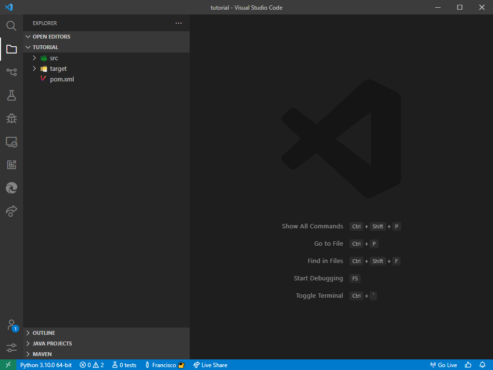
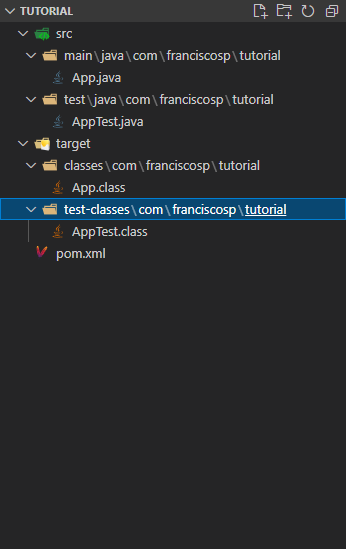

## Why Make a Project?

Projects help to keep your code organized, as the numerous files you're bound to create would begin to clutter your code. In general, it's suggested to keep your code organized in what is called a *directory tree*. Below is a general example of what it would look like for Maven (which is one of the project managers for Java, and the one we will use for this tutorial, since it was included with the Extension Pack for Java).

```text
root (typically named after the project)
├─ src
│  └─ [source code here]...
│
├─ target
│  └─ [compiled code here]...
│
└─ pom.xml
```

This is identical to some other project managers, such as CMake (for C++) and Cargo (for Rust). It is important to use these things because they can make your life far easier when looking for particular files, resources, or classes.

If you look to the left (or right) of your screen, you will see a sidebar with a number of icons (which will vary based on what you have installed). If you click on the folder icon, you will see the directory structure for your open folder, *if* you've opened a folder. Regardless, we will make a new project.

## Making a Project Using Maven for Java


The GIF above will give you an idea of how the process would look like. Keep in mind that my IDE is currently configured for more than one language.

To begin, press `F1` on your keyboard (keep in mind that you may be required to also press `Fn` as well) to open the command palette, then type `Java: Create Java Project...` (without deleting the `>` at the beginning) and press `Enter` (or `Return`) when you see the choice pop up. Then, you will be presented with a number of options, including `No build tools` and `Maven`. You want to select `Maven`, so click or navigate to that option.

Next, you'll be shown a list of various configurations to use for your project. I suggest you use the `maven-archetype-quickstart` option for now.

Next, you'll be shown a list of versions to use for Maven. Use the latest version (`1.4` as of writing this).

Afterwards, you'll be shown a dialog asking you what you want to call your package. By default, it's `com.example`. You could call it whatever you want; for example, I would call this `com.franciscosp.tutorial`. The reason this is required is because you may want to actually publish your code as a library package. If you do, the user of that code would have to import your classes from the package's namespace by using (with my example) `import com.franciscosp.tutorial.*` (which is a "glob" import). All package names *must* be a series of tokens, using lowercase alphanumeric names (which may use underscores) that start with a letter. These tokens may also only be separated with periods.

Then you need to give your project a name. It could be anything, but I will call mine `tutorial`. VS Code will then prompt you for the location where you will be storing the project. Choose a directory such as `~/source/` or your documents folder.

Finally, the terminal on the bottom of the screen will give you an interactive prompt, asking you for additional details, such as the version (for now, just use `0.1.0`) and the type of build (for now, `snapshot` will suffice). VS Code will then give you a notification to say that the project has finally been created. You will want to open that directory in VS Code, so you could either use the notification to open that folder or click `File>Open Folder` to pick the folder you'll work in.

This is where VS Code will restart the window and have the IDE work in that directory. You should see your explorer (which is on the left in the screenshot below) show you the contents of that folder.



In the explorer, you can expand directories and see the contents of your project:



The IDE is now configured for you to start working on your Java code painlessly and efficiently. If you also wish, you could initialize a Git repository (under `Source Control`) to track the changes you make to your code; however, this is not in the scope of this tutorial.

## What About Projects Without Maven, Like Ones for jGRASP?

Visual Studio Code will also present you with the option to "work on code directly" without any build tools. This is done by selecting "No build tools" when you're creating a new Java project.  
This is useful in some circumstances, but is generally discouraged: this makes it difficult to manage your code's dependencies and versioning.

If you're a student, chances are that you're going to be using something like jGRASP, which doesn't have support for Maven and is very lenient with the structure you're allowed to use for your code. In general, you're able to just open an instance of VS Code in the folder containing the jGRASP project without much configuration, if any, and start working on the code directly.

The main reason why you may want to use VS Code over jGRASP in this case would be the tools at your disposal -- jGRASP has almost no tools to help you write code, and requires frequent compilation to evaluate code correctness. On the other hand, VS Code provides Intellisense -- which suggests and completes snippets of code and tells you when you've made syntax errors. It's also effective at refractoring code.

Beyond ease of use and extensibility, VS Code does what jGRASP does -- you can test code, you can compile code, and you can use the integrated terminal to interact with your code. Syntax highlighting is also more advanced: you can tell variables and classes apart.

It's important to make sure that your jGRASP project has all the files you are using in your project, so remember to open it and add your source code to the `sources` of the project.
